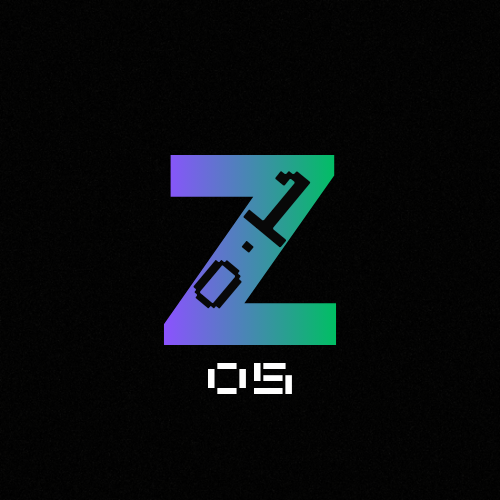

# ZOS

A simple fake OS I made. It's actually not an OS, just a python program runner. So it's not really an OS... Also, it's open source (of course). 
   
ZOS.py can run .py files, which can be either command-line interface (CLI) or Kivy applications, as well as .zpkg files, which are just renamed tar.xz files. 
